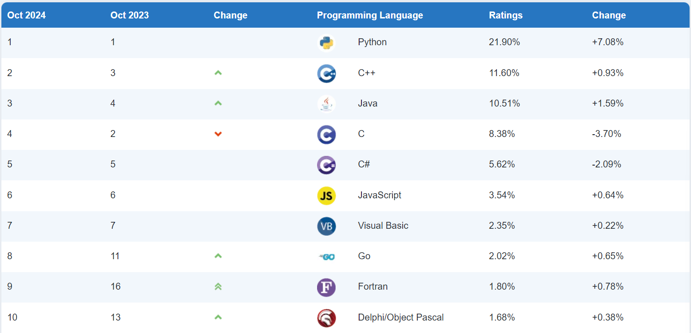
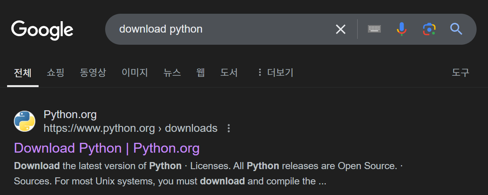
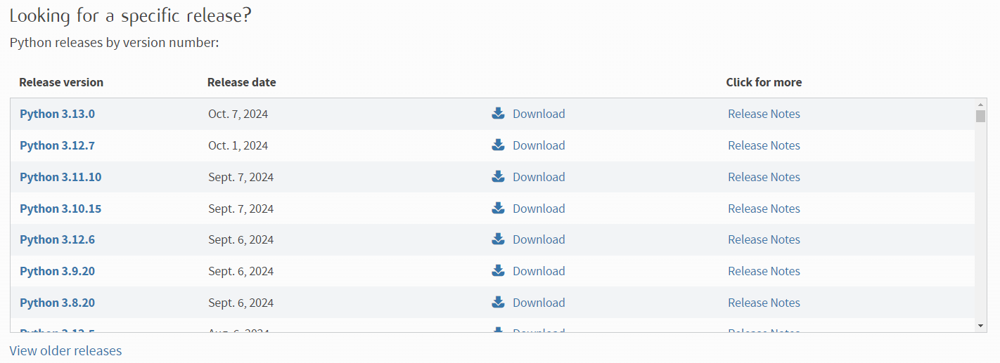

## Chapter 01 - Python 소개

### 학습목표
1. Python에 대하여 설명하고 설치할 수 있다.

### [Python](https://ko.wikipedia.org/wiki/%ED%8C%8C%EC%9D%B4%EC%8D%AC) 소개
1991년 네덜란드계 소프트웨어 엔지니어 [귀도 반 로섬(Guido van Rossum)](https://ko.wikipedia.org/wiki/%EA%B7%80%EB%8F%84_%EB%B0%98_%EB%A1%9C%EC%84%AC)이 발표한 프로그래밍 언어

### Python의 특징
#### 1. 세계에서 가장 인기가 많은 언어
   - https://www.tiobe.com/tiobe-index
        > King of all, Python, is easy to learn and secure, but not fast. Hence, engineers are frantically looking for fast alternatives for Python. \
        > C++ is an obvious candidate, but it is considered "not secure" because of its explicit memory management. \
        > Rust is another candidate, although not easy to learn. Rust is, thanks to its emphasis on security and speed, making its way to the TIOBE index top 10 now.
   
        
        
#### 2. 이름의 유래

코미디 [Monty Python's Flying Circus](https://namu.wiki/w/%EB%AA%AC%ED%8B%B0%20%ED%8C%8C%EC%9D%B4%ED%8A%BC%EC%9D%98%20%EB%B9%84%ED%96%89%20%EC%84%9C%EC%BB%A4%EC%8A%A4)에서 이름을 따옴

#### 3. [비단뱀속(Python)](https://ko.wikipedia.org/wiki/%EB%B9%84%EB%8B%A8%EB%B1%80%EC%86%8D)의 이미지를 마스코트로 사용

- Python과 관련된 패키지에서 뱀의 형상을 종종 찾아볼 수 있음 \
    
    
    

### Python의 장점과 단점
#### Python의 장점
1. 직관적인 문법을 사용하여 배우기 쉬움
2. 간결한 코드로 많은 작업을 할 수 있어 개발 효율성이 높음
3. 강력한 커뮤니티와 생태계를 갖춘 [오픈소스](https://ko.wikipedia.org/wiki/%EC%98%A4%ED%94%88_%EC%86%8C%EC%8A%A4) 코드 (특히, 데이터 분석과 머신러닝)
4. 다양한 운영 체제에서 쉽게 실행될 수 있음

#### Python의 단점
1. [인터프리터](https://ko.wikipedia.org/wiki/%EC%9D%B8%ED%84%B0%ED%94%84%EB%A6%AC%ED%84%B0) 언어의 특성 상, C, C++, Java와 같은 [컴파일 언어](https://ko.wikipedia.org/wiki/%EC%BB%B4%ED%8C%8C%EC%9D%BC_%EC%96%B8%EC%96%B4)에 비해 실행 속도가 느림
   - 하지만 빠른 실행 속도가 필요한 부분은 C로 구현하여 python 프로그램 안에 포함시킬 수 있음

### Python의 응용 분야
- 데스크톱 애플리케이션 개발
- 웹 서버 개발
- 클라우드 인프라 개발
- 데이터 수집 및 분석
- 인공지능과 머신러닝
- 수치 연산 프로그래밍
- 퀀트 투자
- 자동화 작업 등

### Python 설치
1. 대다수 프로그램의 설치는 Google에서 `download 프로그램명`을 검색하여 [공식 사이트](https://www.python.org/downloads/)에 들어가는 것으로 시작합니다.
    
2. 최신 버전의 python을 다운로드하라고 하지만 안정성을 고려하여 이전 버전(`Python 3.12.7`)을 선택합니다. \
    
3. 자세한 설치과정은 [여기](https://wikidocs.net/8)를 참고