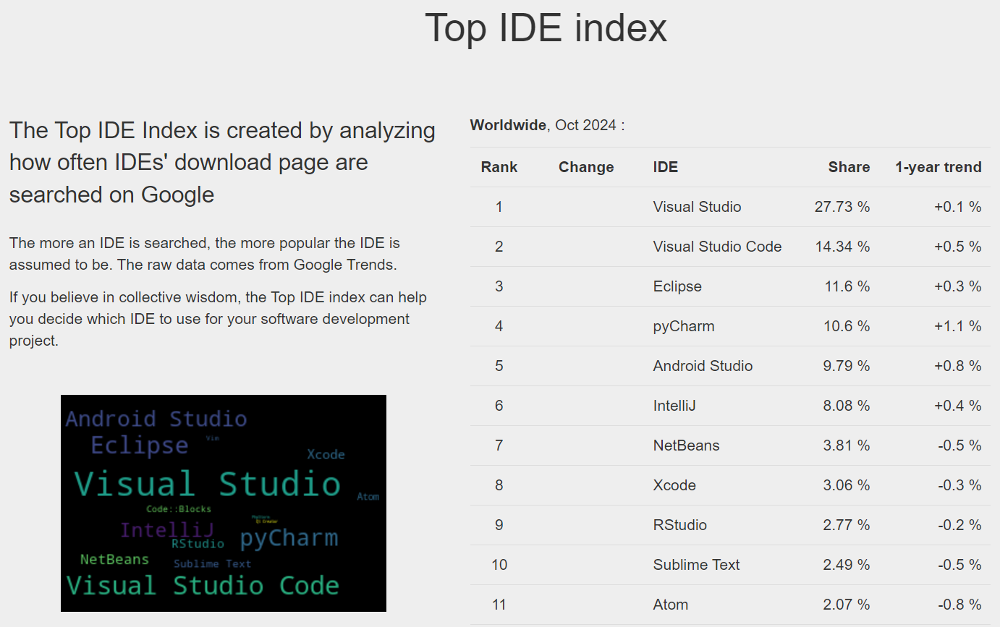

## Chapter 02 - 첫번째 Python 프로그램

### 학습목표
1. Python 코드를 작성할 수 있는 통합 개발 환경을 사용할 수 있다.
2. Python을 이용하여 문자열을 출력하는 프로그램을 작성할 수 있다.

### 코드 작성 및 실행을 위한 도구
#### 기본 대화형 환경
1. Windows의 시작에서 `터미널` 앱을 실행
   - macOS에서도 `터미널` 앱을 실행
2. `python` 입력하여 python을 실행
3. 간단한 예제를 따라 쳐보자. 각 줄의 마지막에 `Enter`키를 입력하여 코드를 실행시킬 수 있다.
    ```Bash
    Python 3.12.3 | packaged by conda-forge | (main, Apr 15 2024, 18:20:11) [MSC v.1938 64 bit (AMD64)] on win32
    Type "help", "copyright", "credits" or "license" for more information.
    >>> 2 * 3
    6
    >>> 2 + 3
    5
    >>>
    ```
4. `quit()`을 입력하여 종료
    ```Bash
    >>> quit()
    ```

#### 더 나은 대화형 환경 - IPython
IPython 프로그램을 통해 더욱 간편한 편집 및 대화형 기능을 사용할 수 있다.
1. `Ipython` 설치
    ```bash
    pip install ipython
    ```
    - [pip(package installer for Python)](https://pypi.org/project/pip/): Python의 패키지 관리자로서 Python과 관련된 패키지 및 프로그램을 설치할 수 있다
2. `Ipython` 시작
    ```bash
    ipython
    ```
3. 이전 예제를 따라 쳐보며 차이를 느껴보자

#### 통합 개발 환경 - Visual Studio Code
- [통합 개발 환경(IDE, Integrated Development Environment)](https://ko.wikipedia.org/wiki/%ED%86%B5%ED%95%A9_%EA%B0%9C%EB%B0%9C_%ED%99%98%EA%B2%BD) \
프로그램 개발에 관련된 모든 작업을 하나의 프로그램 안에서 처리하는 환경

1. 과거 다양한 IDE들이 사용되었으나 지금은 Microsoft에서 개발한 [Visual Studio Code(vscode)](https://code.visualstudio.com/)가 가장 인기가 많고 권장된다.
   - https://pypl.github.io/IDE.html
    
2. Google에서 `download vscode`를 입력하여 공식 사이트에 들어가 설치할 수 있다.


### Hello, world!
전통적으로 프로그래밍 언어를 배울 때 작성하는 첫 번째 프로그램으로 [Hello, world!](https://ko.wikipedia.org/wiki/%22Hello,_World!%22_%ED%94%84%EB%A1%9C%EA%B7%B8%EB%9E%A8) 라는 문자열을 출력하는 예제를 사용한다.

1. 다음 코드를 작성해보자.
    ```Python
    print('Hello, world!')
    ```
2. 실행 결과는 예상대로 "Hello, world!" 라는 문자열이 출력된다.

### 코드에 주석 달기
두 가지 형태의 주석을 사용할 수 있다.
1. 한 줄 주석: `#` 로 시작
2. 여러 줄 주석: 따옴표 3개를 사용 (큰 따옴표 `"`, 작은 따옴표 `'` 모두 사용 가능)

```Python
"""
**Author**: 骆昊
"""
# print("Hello, world!")
print("안녕, 세상!")
```
