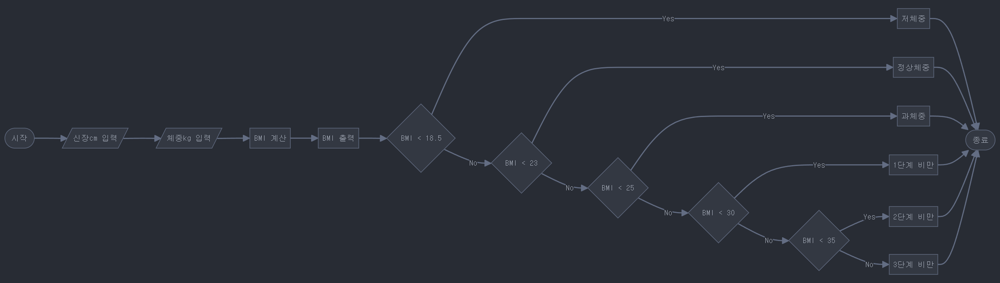

## Chapter 06 - 반복 구조

### 학습목표
1. `for`, `while` 등을 이용하여 반복 구조를 구현할 수 있다.

### if, match를 사용한 분기 구조 구현
`if`, `elif`, `else`, `match`, `case` 키워드를 사용하여 분기 구조를 구현할 수 있다.
- **분기 구조**, **분기문**, **조건문** 모두 비슷한 의미를 가진다.

#### 예제 1: 체질량지수(BMI) 계산
$BMI = \frac{W}{H^{2}}$
- $W$: 체중
- $H$: 신장



```python
"""
BMI 계산기(if문 활용)

Version: 1.0
Author: Alchemine
"""
height = float(input('신장(cm)：'))
weight = float(input('체중(kg)：'))
bmi = weight / (height / 100) ** 2
print(f'{bmi = :.1f}')
if bmi < 18.5:
    print('저체중입니다.')
elif bmi < 23:
    print('정상체중입니다.')
elif bmi < 25:
    print('과체중입니다.')
elif bmi < 30:
    print('1단계 비만입니다.')
elif bmi < 35:
    print('2단계 비만입니다.')
else:
    print('3단계 비만입니다.')
```

#### 예제 2: 응답 상태 코드 처리기
```python
"""
응답 상태 코드 처리기(if문 활용)

Version: 1.0
Author: 骆昊
"""
status_code = int(input('응답 상태 코드: '))
if status_code == 400:
    description = 'Bad Request'
elif status_code == 401:
    description = 'Unauthorized'
elif status_code == 403:
    description = 'Forbidden'
elif status_code == 404:
    description = 'Not Found'
elif status_code == 405:
    description = 'Method Not Allowed'
else:
    description = 'Unknown status Code'
print('상태 코드 설명:', description)
```

```python
"""
응답 상태 코드 처리기(match문 활용)

Version: 1.0
Author: 骆昊
"""
status_code = int(input('응답 상태 코드: '))
match status_code:
    case 400: description = 'Bad Request'
    case 401: description = 'Unauthorized'
    case 403: description = 'Forbidden'
    case 404: description = 'Not Found'
    case 405: description = 'Method Not Allowed'
    case _: description = 'Unknown Status Code'
print('상태 코드 설명:', description)
```

#### 예제 3: 중첩 분기 구조
```python
"""
과목 점수를 등급으로 변환

Version: 1.0
Author: Alchemine
"""

subject = input("과목을 입력하세요: ")
score = float(input("점수를 입력하세요: "))

desc = 
match subject:
    case "언어":
        if score >= 80:
            grade = "A"
        elif score > 40
            grade = "B"
        else:
            grade = "C"

    case "수학":
        if score >= 70:
            grade = "A"
        elif score > 50
            grade = "B"
        else:
            grade = "C"

print(f"{subject}의 {score}점수의 등급: {grade}")
```
